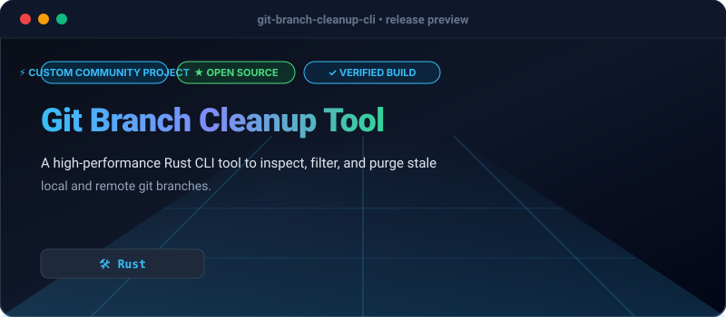

# Git Branch Cleanup Tool

[](https://github.com/Olamideakinade/git-branch-cleanup-cli)
[](https://opensource.org/licenses/MIT)



`git-branch-cleanup-cli` is a command-line utility written in Rust designed to identify, inspect, and purge merged or stale local Git branches safely and efficiently.

## Key Capabilities

- **Merge Inspection**: Automatically detects local branches merged into a specified base branch.
- **Age-Based Filtering**: Target stale branches older than a specified number of days.
- **Protected Branches**: Shield critical branches from accidental deletion via patterns.
- **Dry-Run Mode**: Preview exact cleanup actions without modifying the repository state.
- **JSON Export**: Output scan results in JSON format for automated scripting and CI/CD pipelines.

## Installation

```bash
cargo install git-branch-cleanup-cli
```

## Usage

```bash
# Interactively clean up merged branches against main
git-branch-cleanup-cli

# Preview deletions without executing them
git-branch-cleanup-cli --dry-run

# Export branch status as JSON
git-branch-cleanup-cli --json
```
